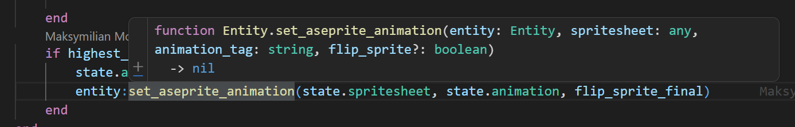

# arcane_assembly
A WIP demo for the bevy_mod_scripting framework in game form

## Local Development

### Running the game

Simply run `cargo run`

### Scripting environment

In order to see type hinting within lua scripts you need to set up a lua language server plugin in your IDE.
On vscode it's simply a case of installing: https://marketplace.visualstudio.com/items?itemName=sumneko.lua

the `.luarc.json` configuration file sets up the project structure and points LLS to the generated bindings file.
If any bindings are updated, these files are automatically updated every `cargo run`.

Changes to scripts are automatically hot-reloaded and therefore do not require re-compilation.
